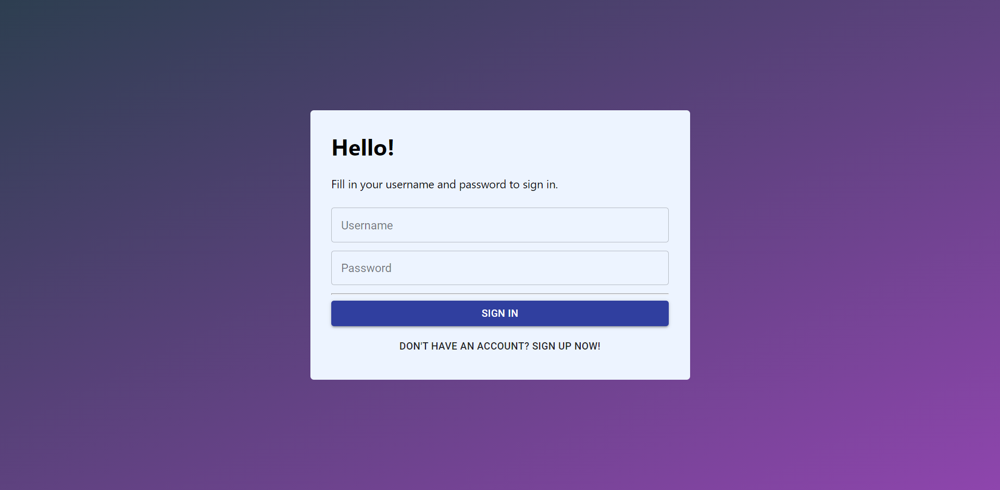
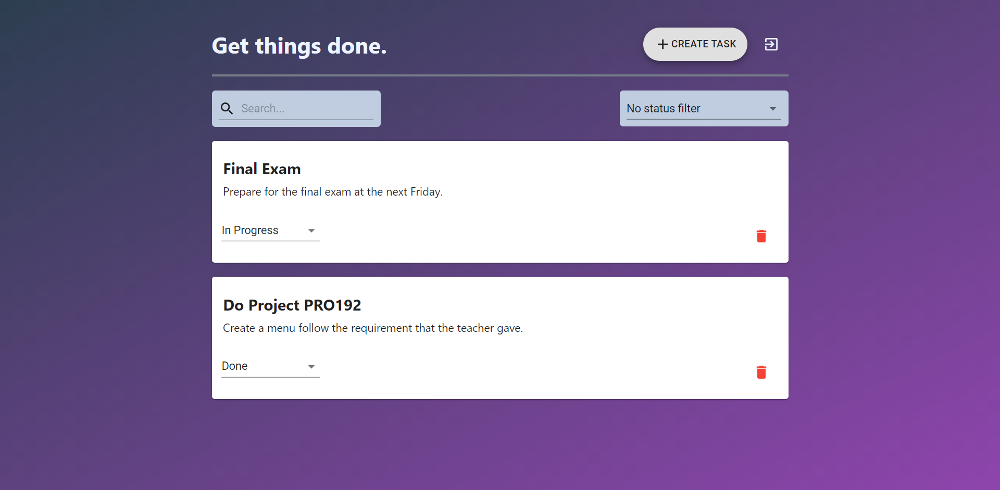

#  - Task Management

## [Live demo](https://youtu.be/8QvVxK2__P4)

## What is Task Management?
A web application that may save you from missing tasks.
But this is still a simple one. 

Here is [the Backend](https://github.com/kien123456k/task-management-backend) that this app is using.

`The more full feature is comming soon!`

## Technology
- Frontend
  - React - A JavaScript library for building user interfaces
  - Create React App - React starter template
  - MobX - State Management
  - Material UI - UI components
  - Styled-components - Styling
  - Typescript - Static Type Checker
- Backend
  - NestJS - Server Core
  - Mongoose + MongoDB - Database
  - Passport - Authentication

## Some preview images



## Project Setup

Before jump into this project, you need to create `.env.local` with properties like `.env.example`, replace REACT_APP_BASE_URL value with your API URL.
Install dependencies
```
yarn install
```
Start application in local
```
yarn start
```

Build for deploy
```
yarn build
```
## Reference

This application is configuration of [task-management-frontend](https://github.com/arielweinberger/task-management-frontend) of [Ariel Weinberger](https://github.com/arielweinberger).

# License & copyright

© Kirin Tran, FPT University TP.HCM
Licensed under the [MIT LICENSE](LICENSE).